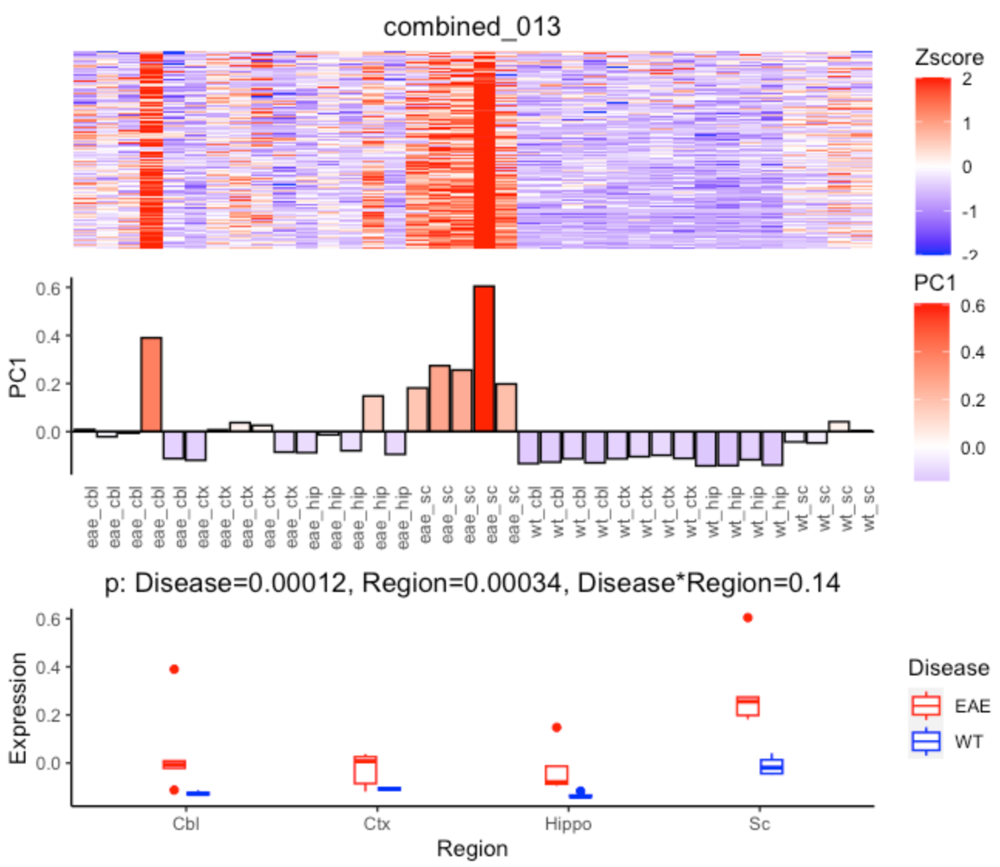
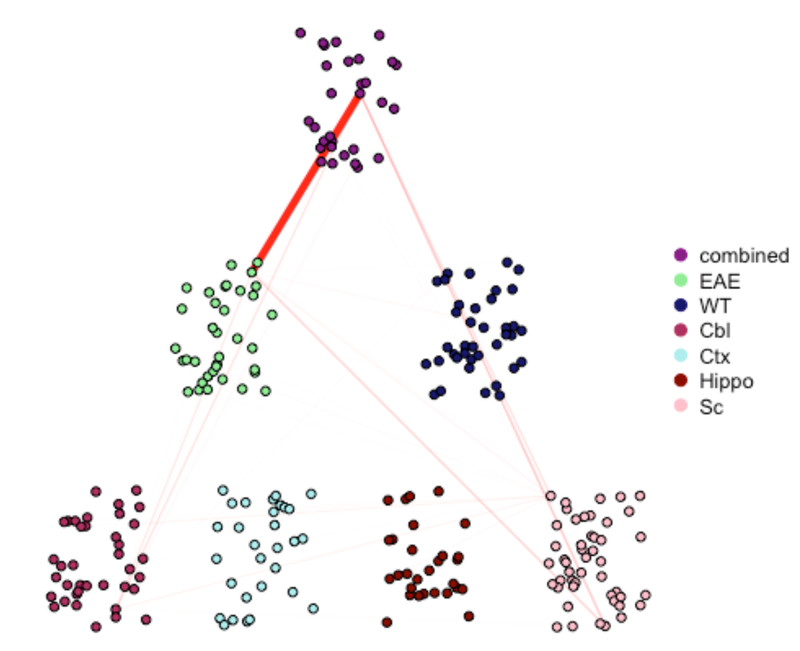

# multiWGCNA: an R package for deep mining gene co-expression networks in multi-trait expression data

The multiWGCNA R package can be applied to expression data with two dimensions, which is especially useful for the study of disease-associated modules across time or space. The multiWGCNA paper is available at https://doi.org/10.1186/s12859-023-05233-z. 

# Installation 
The multiWGCNA R package can be installed from GitHub like this: 
```
if(!require(devtools)) install.packages("devtools")
devtools::install_github("fogellab/multiWGCNA")
```

If you would like to build the vignettes, you must specify build_vignettes = TRUE. 
```
if(!require(devtools)) install.packages("devtools")
devtools::install_github("fogellab/multiWGCNA", build_vignettes = TRUE)
```


# Dependencies

multiWGCNA has been tried and tested successfully using the following dependency versions. multiWGCNA may not work for older or newer versions of these dependencies. 

1. stringr_1.4.0
2. readr_2.0.2
3. WGCNA_1.70-3
4. vegan_2.5-7
5. dplyr_1.0.7
6. reshape2_1.4.4
7. data.table_1.14.6
8. patchwork_1.1.1
9. doParallel_1.0.17
10. scales_1.2.1
11. igraph_1.2.7
12. flashClust_1.01-2
13. filesstrings_3.2.2
14. ggplot2_3.4.0
15. biomaRt_2.46.3
16. dcanr_1.6.0
17. goseq_1.42.0
18. readr_2.0.2
19. vegan_2.5-7 
20. GO.db_3.12.1
21. cowplot_1.1.1
22. ggalluvial_0.12.3

# Vignettes

Please refer to the vignette, generalWorkflow.Rmd, for a detailed example of how to use multiWGCNA.

For a tutorial using the astrocyte Ribotag data discussed in the manuscript (Tommasini and Fogel. BMC Bioinformatics. 2023), please refer to astrocyte_map2.Rmd.  

# Quickstart

Load multiWGCNA package
```
library(multiWGCNA)
```

Load astrocyte Ribotag data
```
# Load data
data(astrocyte_data)
data(astrocyte_metadata)

datExpr = astrocyte_data
sampleTable = astrocyte_metadata

# To save time, load pre-computed networks 
data(astrocyte_networks)

myNetworks = astrocyte_networks
```
Next, we compare modules (by hypergeometric overlap) across conditions. We’ll save the results in a list.

```
results = list()
results$overlaps = iterate(myNetworks, overlapComparisons, plot=FALSE)

# You can check the expression of module M13 from Tommasini and Fogel. BMC Bioinformatics. 2023 like this. Note that the values reported in the bottom panel title are p-values and not FDR-adjusted like in results$diffModExp
diffModuleExpression(myNetworks[["combined"]], 
                     geneList = topNGenes(myNetworks[[1]], "combined_013"), 
                     test = "ANOVA",
                     design = sampleTable,
                     moduleName = "combined_013",
                     plot = TRUE)
```


```
drawMultiWGCNAnetwork(myNetworks, 
                      results$overlaps, 
                      "combined_013", 
                      design = sampleTable, 
                      overlapCutoff = 0, 
                      padjCutoff = 1, 
                      removeOutliers = T, 
                      alpha = 1e-50, 
                      layout = NULL, 
                      hjust = 0.4, 
                      vjust = 0.3, 
                      width = 0.5)
```



# Citation

To cite multiWGCNA in publications use:

  Tommasini, D, Fogel, BL (2023). multiWGCNA: an R package for deep mining gene co-expression networks in multi-trait expression data. BMC Bioinformatics, 24,
  1:115.

A BibTeX entry for LaTeX users is

```
  @Article{,
    title = {multiWGCNA: an R package for deep mining gene co-expression networks in multi-trait expression data},
    author = {Dario Tommasini and Brent L. Fogel},
    journal = {BMC Bioinformatics},
    year = {2023},
    volume = {24},
    number = {1},
    pages = {115},
  }
```
