```r
library(multiWGCNA)
```

step 1: read in data and create your design matrix. Let's also set some useful global variables, like the alpha level of significance and the soft thresholding power for our networks. 


```r
expressionFile="/Users/Dario/Desktop/Research/Fogel_Lab/Data/Voineagu_Nature_2011/autism_logTransformed.csv"
traitFile="/Users/Dario/Desktop/Research/Fogel_Lab/Data/Voineagu_Nature_2011/autism_traitData.csv"
datExpr=read.csv(expressionFile, header=T)
datExpr[1:5,1:5]
#>              X GSM706412 GSM706413 GSM706414 GSM706415
#> 1 ILMN_1343291  15.23359  15.43815  15.43815  15.38260
#> 2 ILMN_1651228  13.87290  14.00369  14.09760  13.77983
#> 3 ILMN_1651229  11.01956  11.04880  12.14015  11.08806
#> 4 ILMN_1651254  11.13110  11.69212  11.44648  10.71059
#> 5 ILMN_1651262  12.23556  12.52034  12.44783  12.42466
sampleTable=read.csv(traitFile, header=T)
sampleTable
#>       Sample   Status Tissue
#> 1  GSM706412   autism     FC
#> 2  GSM706413   autism     FC
#> 3  GSM706414   autism     FC
#> 4  GSM706415   autism     FC
#> 5  GSM706416   autism     FC
#> 6  GSM706417   autism     FC
#> 7  GSM706418   autism     FC
#> 8  GSM706419   autism     FC
#> 9  GSM706420   autism     FC
#> 10 GSM706421   autism     FC
#> 11 GSM706422   autism     FC
#> 12 GSM706423   autism     FC
#> 13 GSM706424   autism     FC
#> 14 GSM706425   autism     FC
#> 15 GSM706426   autism     FC
#> 16 GSM706427   autism     FC
#> 17 GSM706428 controls     FC
#> 18 GSM706429 controls     FC
#> 19 GSM706430 controls     FC
#> 20 GSM706431 controls     FC
#> 21 GSM706432 controls     FC
#> 22 GSM706433 controls     FC
#> 23 GSM706434 controls     FC
#> 24 GSM706435 controls     FC
#> 25 GSM706436 controls     FC
#> 26 GSM706437 controls     FC
#> 27 GSM706438 controls     FC
#> 28 GSM706439 controls     FC
#> 29 GSM706440 controls     FC
#> 30 GSM706441 controls     FC
#> 31 GSM706442 controls     FC
#> 32 GSM706443 controls     FC
#> 33 GSM706444   autism     TC
#> 34 GSM706445   autism     TC
#> 35 GSM706446   autism     TC
#> 36 GSM706447   autism     TC
#> 37 GSM706448   autism     TC
#> 38 GSM706449   autism     TC
#> 39 GSM706450   autism     TC
#> 40 GSM706451   autism     TC
#> 41 GSM706452   autism     TC
#> 42 GSM706453   autism     TC
#> 43 GSM706454   autism     TC
#> 44 GSM706455   autism     TC
#> 45 GSM706456   autism     TC
#> 46 GSM706457 controls     TC
#> 47 GSM706458 controls     TC
#> 48 GSM706459 controls     TC
#> 49 GSM706460 controls     TC
#> 50 GSM706461 controls     TC
#> 51 GSM706462 controls     TC
#> 52 GSM706463 controls     TC
#> 53 GSM706464 controls     TC
#> 54 GSM706465 controls     TC
#> 55 GSM706466 controls     TC
#> 56 GSM706467 controls     TC
#> 57 GSM706468 controls     TC
#> 58 GSM706469 controls     TC
alphaLevel=0.05
softPower=10
detectNumbers=FALSE
```

step 2: perform network construction, module eigengene calculation, module-trait correlation. Let's use power=10 since Voineagu et al. 2011 used that for all their networks. Also, let's find best trait and identify outlier modules.


```r
conditions1=unique(sampleTable[,2])
conditions2=unique(sampleTable[,3])
myNetworks=constructNetworks(datExpr, sampleTable, conditions1, conditions2, TOMType = "unsigned", 
                                  power = 10, minModuleSize = 40, maxBlockSize = 25000,
                                  reassignThreshold = 0, minKMEtoSay=0.7, mergeCutHeight = 0.10,
                                  numericLabels = TRUE, pamRespectsDendro = FALSE, verbose=3)
#>  Calculating module eigengenes block-wise from all genes
#>    Flagging genes and samples with too many missing values...
#>     ..step 1
#>  ..Working on block 1 .
#>     TOM calculation: adjacency..
#>     ..will not use multithreading.
#>      Fraction of slow calculations: 0.000000
#>     ..connectivity..
#>     ..matrix multiplication (system BLAS)..
#>     ..normalization..
#>     ..done.
#>  ....clustering..
#>  ....detecting modules..
#>  ....calculating module eigengenes..
#>  ....checking kME in modules..
#>      ..removing 19 genes from module 1 because their KME is too low.
#>      ..removing 4 genes from module 2 because their KME is too low.
#>      ..removing 1 genes from module 14 because their KME is too low.
#>  ..merging modules that are too close..
#>      mergeCloseModules: Merging modules whose distance is less than 0.1
#>        Calculating new MEs...
#>  softConnectivity: FYI: connecitivty of genes with less than 20 valid samples will be returned as NA.
#>  ..calculating connectivities.. ..0% ..15% ..30% ..45% ..60% ..75% ..90% ..100% 
#>  Calculating module eigengenes block-wise from all genes
#>    Flagging genes and samples with too many missing values...
#>     ..step 1
#>  ..Working on block 1 .
#>     TOM calculation: adjacency..
#>     ..will not use multithreading.
#>      Fraction of slow calculations: 0.000000
#>     ..connectivity..
#>     ..matrix multiplication (system BLAS)..
#>     ..normalization..
#>     ..done.
#>  ....clustering..
#>  ....detecting modules..
#>  ....calculating module eigengenes..
#>  ....checking kME in modules..
#>      ..removing 3 genes from module 1 because their KME is too low.
#>      ..removing 5 genes from module 2 because their KME is too low.
#>      ..removing 1 genes from module 3 because their KME is too low.
#>      ..removing 2 genes from module 4 because their KME is too low.
#>      ..removing 11 genes from module 5 because their KME is too low.
#>      ..removing 1 genes from module 7 because their KME is too low.
#>      ..removing 1 genes from module 17 because their KME is too low.
#>  ..merging modules that are too close..
#>      mergeCloseModules: Merging modules whose distance is less than 0.1
#>        Calculating new MEs...
#>  softConnectivity: FYI: connecitivty of genes with less than 10 valid samples will be returned as NA.
#>  ..calculating connectivities.. ..0% ..15% ..30% ..45% ..60% ..75% ..90% ..100% 
#>  Calculating module eigengenes block-wise from all genes
#>    Flagging genes and samples with too many missing values...
#>     ..step 1
#>  ..Working on block 1 .
#>     TOM calculation: adjacency..
#>     ..will not use multithreading.
#>      Fraction of slow calculations: 0.000000
#>     ..connectivity..
#>     ..matrix multiplication (system BLAS)..
#>     ..normalization..
#>     ..done.
#>  ....clustering..
#>  ....detecting modules..
#>  ....calculating module eigengenes..
#>  ....checking kME in modules..
#>      ..removing 30 genes from module 1 because their KME is too low.
#>      ..removing 2 genes from module 2 because their KME is too low.
#>      ..removing 9 genes from module 3 because their KME is too low.
#>      ..removing 4 genes from module 4 because their KME is too low.
#>      ..removing 1 genes from module 6 because their KME is too low.
#>      ..removing 1 genes from module 9 because their KME is too low.
#>  ..merging modules that are too close..
#>      mergeCloseModules: Merging modules whose distance is less than 0.1
#>        Calculating new MEs...
#>  softConnectivity: FYI: connecitivty of genes with less than 10 valid samples will be returned as NA.
#>  ..calculating connectivities.. ..0% ..15% ..30% ..45% ..60% ..75% ..90% ..100% 
#>  Calculating module eigengenes block-wise from all genes
#>    Flagging genes and samples with too many missing values...
#>     ..step 1
#>  ..Working on block 1 .
#>     TOM calculation: adjacency..
#>     ..will not use multithreading.
#>      Fraction of slow calculations: 0.000000
#>     ..connectivity..
#>     ..matrix multiplication (system BLAS)..
#>     ..normalization..
#>     ..done.
#>  ....clustering..
#>  ....detecting modules..
#>  ....calculating module eigengenes..
#>  ....checking kME in modules..
#>      ..removing 9 genes from module 1 because their KME is too low.
#>      ..removing 20 genes from module 2 because their KME is too low.
#>      ..removing 1 genes from module 10 because their KME is too low.
#>  ..merging modules that are too close..
#>      mergeCloseModules: Merging modules whose distance is less than 0.1
#>        Calculating new MEs...
#>  softConnectivity: FYI: connecitivty of genes with less than 11 valid samples will be returned as NA.
#>  ..calculating connectivities.. ..0% ..15% ..30% ..45% ..60% ..75% ..90% ..100% 
#>  Calculating module eigengenes block-wise from all genes
#>    Flagging genes and samples with too many missing values...
#>     ..step 1
#>  ..Working on block 1 .
#>     TOM calculation: adjacency..
#>     ..will not use multithreading.
#>      Fraction of slow calculations: 0.000000
#>     ..connectivity..
#>     ..matrix multiplication (system BLAS)..
#>     ..normalization..
#>     ..done.
#>  ....clustering..
#>  ....detecting modules..
#>  ....calculating module eigengenes..
#>  ....checking kME in modules..
#>      ..removing 22 genes from module 1 because their KME is too low.
#>      ..removing 7 genes from module 2 because their KME is too low.
#>      ..removing 12 genes from module 3 because their KME is too low.
#>      ..removing 2 genes from module 4 because their KME is too low.
#>      ..removing 3 genes from module 5 because their KME is too low.
#>      ..removing 1 genes from module 6 because their KME is too low.
#>      ..removing 3 genes from module 8 because their KME is too low.
#>  ..merging modules that are too close..
#>      mergeCloseModules: Merging modules whose distance is less than 0.1
#>        Calculating new MEs...
#>  softConnectivity: FYI: connecitivty of genes with less than 9 valid samples will be returned as NA.
#>  ..calculating connectivities.. ..0% ..15% ..30% ..45% ..60% ..75% ..90% ..100%
```

step 3: compare modules (by hypergeometric overlap) across conditions


```r
results=list()
results$overlaps=iterate(myNetworks, overlapComparisons, plot=TRUE)
#> 
#> #### comparing  combined  and  autism ####
```

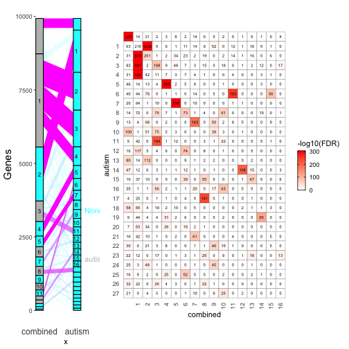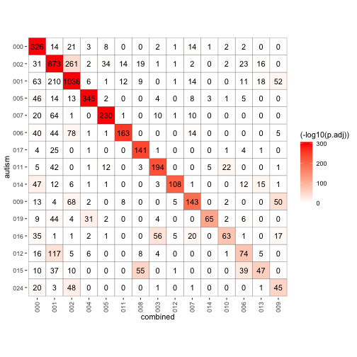

```
#> 
#> #### comparing  combined  and  controls ####
```

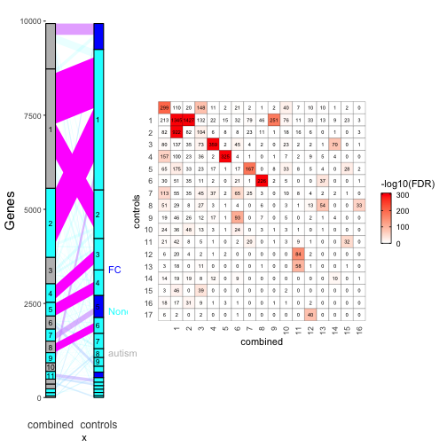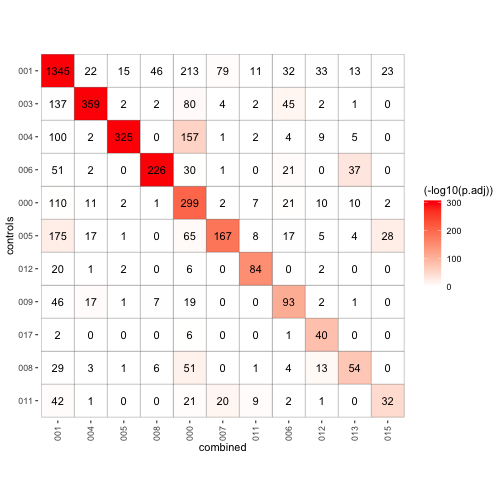

```
#> 
#> #### comparing  combined  and  FC ####
```

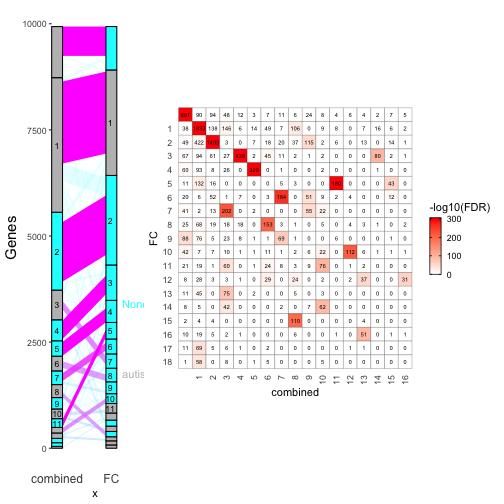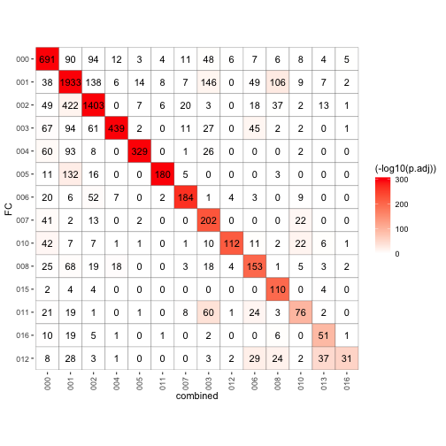

```
#> 
#> #### comparing  combined  and  TC ####
```

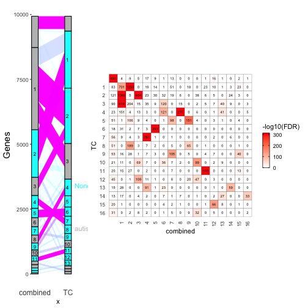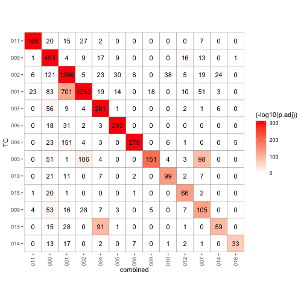

```
#> 
#> #### comparing  autism  and  controls ####
```

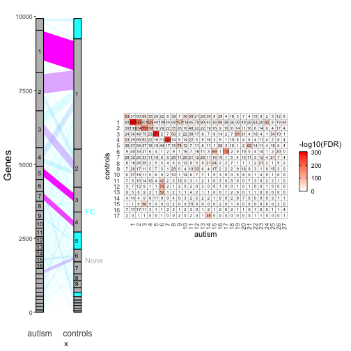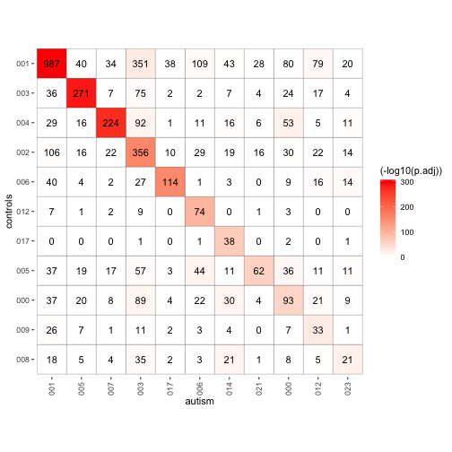

```
#> 
#> #### comparing  autism  and  FC ####
```

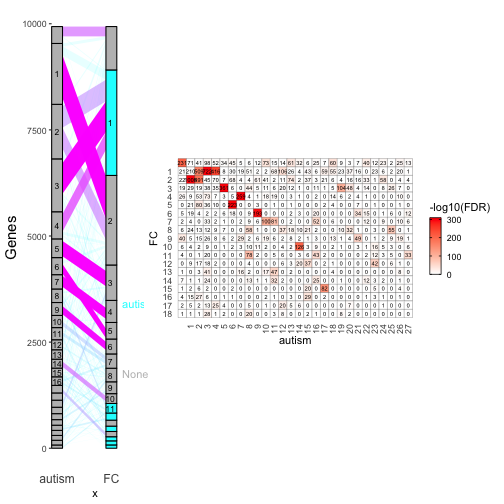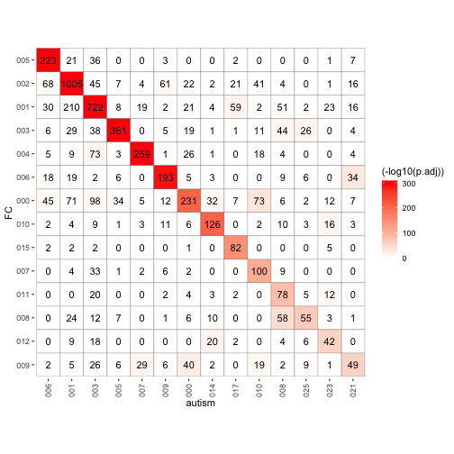

```
#> 
#> #### comparing  autism  and  TC ####
```

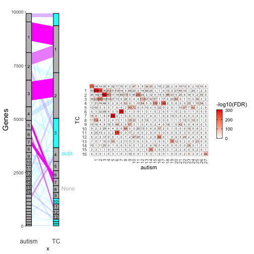

```
#> 
#> #### comparing  controls  and  FC ####
```

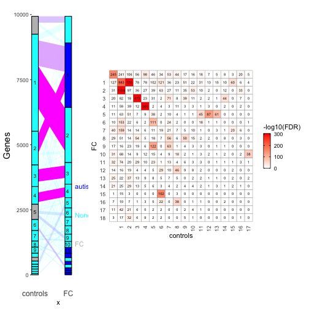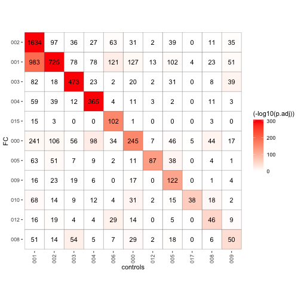

```
#> 
#> #### comparing  controls  and  TC ####
```

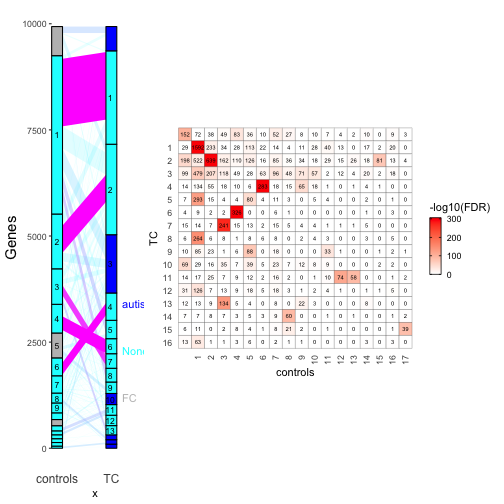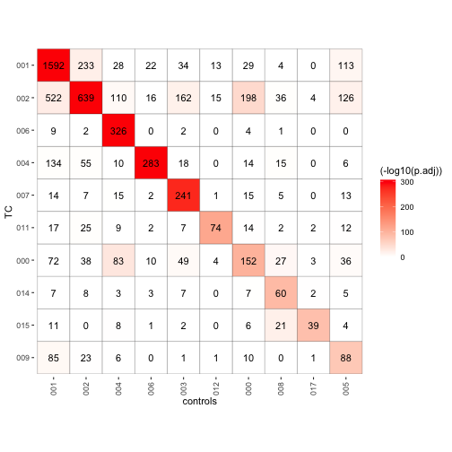

```
#> 
#> #### comparing  FC  and  TC ####
```

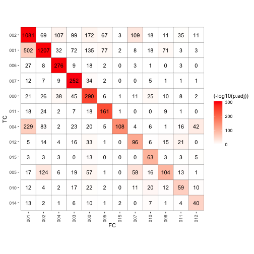

step 4: perform differential module expression analysis


```r
results$diffModExp=runDME(myNetworks[["combined"]], p.adjust="fdr", refCondition="Tissue", testCondition="Status", plot=TRUE)
#> [1] "#### plotting combined_000 ####"
#> [1] "#### plotting combined_001 ####"
#> [1] "#### plotting combined_002 ####"
#> [1] "#### plotting combined_003 ####"
#> [1] "#### plotting combined_004 ####"
#> [1] "#### plotting combined_005 ####"
#> [1] "#### plotting combined_006 ####"
#> [1] "#### plotting combined_007 ####"
#> [1] "#### plotting combined_008 ####"
#> [1] "#### plotting combined_009 ####"
#> [1] "#### plotting combined_010 ####"
#> [1] "#### plotting combined_011 ####"
#> [1] "#### plotting combined_012 ####"
#> [1] "#### plotting combined_013 ####"
#> [1] "#### plotting combined_014 ####"
#> [1] "#### plotting combined_015 ####"
#> [1] "#### plotting combined_016 ####"
results$diffModExp
#>                   Status Status*Tissue    Tissue
#> combined_000 0.093539438     0.9588446 0.7347277
#> combined_001 0.029297664     0.9588446 0.7347277
#> combined_002 0.239384613     0.9588446 0.7460851
#> combined_003 0.009733273     0.9588446 0.7460851
#> combined_004 0.563629353     0.9588446 0.7460851
#> combined_005 0.382412760     0.9588446 0.7347277
#> combined_006 0.008102452     0.9588446 0.7460851
#> combined_007 0.352723786     0.9588446 0.7347277
#> combined_008 0.045473231     0.9588446 0.9771078
#> combined_009 0.207641295     0.9588446 0.7347277
#> combined_010 0.000225544     0.9588446 0.7347277
#> combined_011 0.104342710     0.9588446 0.7347277
#> combined_012 0.029297664     0.9786968 0.7347277
#> combined_013 0.001196278     0.9588446 0.7460851
#> combined_014 0.187366160     0.9588446 0.7890425
#> combined_015 0.747145560     0.9588446 0.7347277
#> combined_016 0.044339556     0.9588446 0.7460851
```

step 5: perform the module preservation analysis to determine if any modules 
in one dataset are not preserved in the other. 


```r
results$preservation=iterate(myNetworks[conditions1], preservationComparisons, plot=TRUE)
#> [1] 0.05
#>  Flagging genes and samples with too many missing values...
#>   ..step 1
#>  Flagging genes and samples with too many missing values...
#>   ..step 1
#>   ..checking data for excessive amounts of missing data..
#>      Flagging genes and samples with too many missing values...
#>       ..step 1
#>      Flagging genes and samples with too many missing values...
#>       ..step 1
#>   ..unassigned 'module' name: grey 
#>   ..all network sample 'module' name: gold
#>   ..calculating observed preservation values
#>   ..calculating permutation Z scores
#>  ..Working with set 1 as reference set
#>  ....working with set 2 as test set
#>   ......parallel calculation of permuted statistics..
#>  Flagging genes and samples with too many missing values...
#>   ..step 1
#>  Flagging genes and samples with too many missing values...
#>   ..step 1
#>   ..checking data for excessive amounts of missing data..
#>      Flagging genes and samples with too many missing values...
#>       ..step 1
#>      Flagging genes and samples with too many missing values...
#>       ..step 1
#>   ..unassigned 'module' name: grey 
#>   ..all network sample 'module' name: gold
#>   ..calculating observed preservation values
#>   ..calculating permutation Z scores
#>  ..Working with set 1 as reference set
#>  ....working with set 2 as test set
#>   ......parallel calculation of permuted statistics..
```

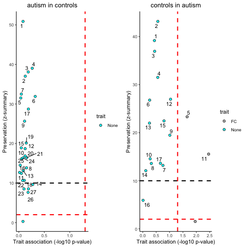

step 7: summarize interesting results from the analyses, such as non-preserved trait-associated modules and differentially expressed modules. 


```r
summarizeResults(myNetworks, results)
#> 
#> ### Non-preserved modules ###
#> 
#> ### Differentially expressed modules ###
#>                   Status Status*Tissue    Tissue
#> combined_001 0.029297664     0.9588446 0.7347277
#> combined_003 0.009733273     0.9588446 0.7460851
#> combined_006 0.008102452     0.9588446 0.7460851
#> combined_008 0.045473231     0.9588446 0.9771078
#> combined_010 0.000225544     0.9588446 0.7347277
#> combined_012 0.029297664     0.9786968 0.7347277
#> combined_013 0.001196278     0.9588446 0.7460851
#> combined_016 0.044339556     0.9588446 0.7460851
```
